# Documentation

## Conventions

Below are the conventions that we will follow in our UML class diagrams.

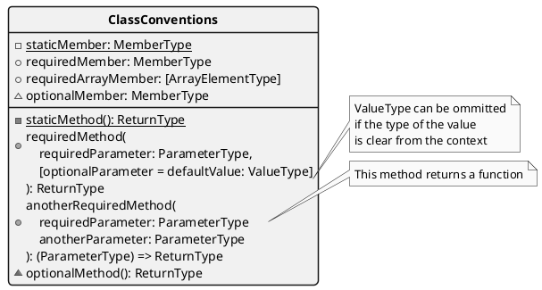

```plantuml
@startuml
  skinparam shadowing false
  skinparam roundcorner 9
  skinparam monochrome true
  skinparam classBorderThickness 1.5
  skinparam classFontStyle bold
  skinparam ArrowThickness 2
  skinparam tabsize 3
  hide circle

  class "**AbstractClass**" as AbstractClass <<Abstract>> {
    # {abstract} abstractMember: MemberType
    # {abstract} abstractMethod(): ReturnType
  }

  note left of AbstractClass::abstractMember
    To be instantiated
    in a subclass
  endnote

  note left of AbstractClass::abstractMethod
    To be implemented
    in a subclass
  endnote

  note left of ConcreteClass::abstractMember
    Overriden/instantiated
    over superclass
  endnote

  note right of ConcreteClass::abstractMember
    ValueType can be ommitted
    if the type of the value
    is clear from the context
  endnote

  note left of ConcreteClass::abstractMethod
    Overriden/implemented
    over superclass
  endnote

  class "**ConcreteClass**" as ConcreteClass {
    + requiredMemberOfConcreteClass: MemberType
    ..//Inherited from// AbstractClass..
    # abstractMember = concreteValue: ValueType
    --
    + requiredMethodOfConcreteClass(): ReturnType
    ..//Overriden over// AbstractClass..
    # abstractMethod(): ReturnType
  }

  AbstractClass <|-- ConcreteClass
@enduml
```

## Server-side classes

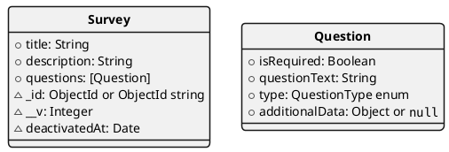

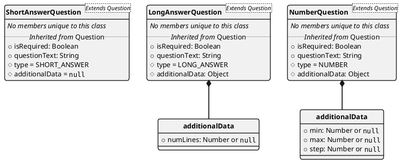

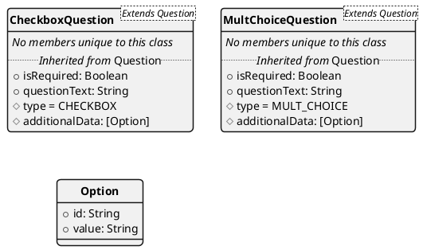

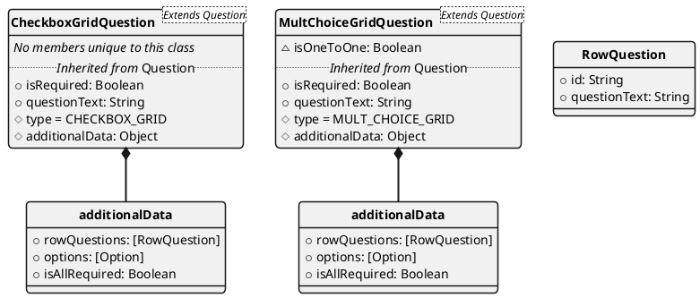

## Client-side

### Classes

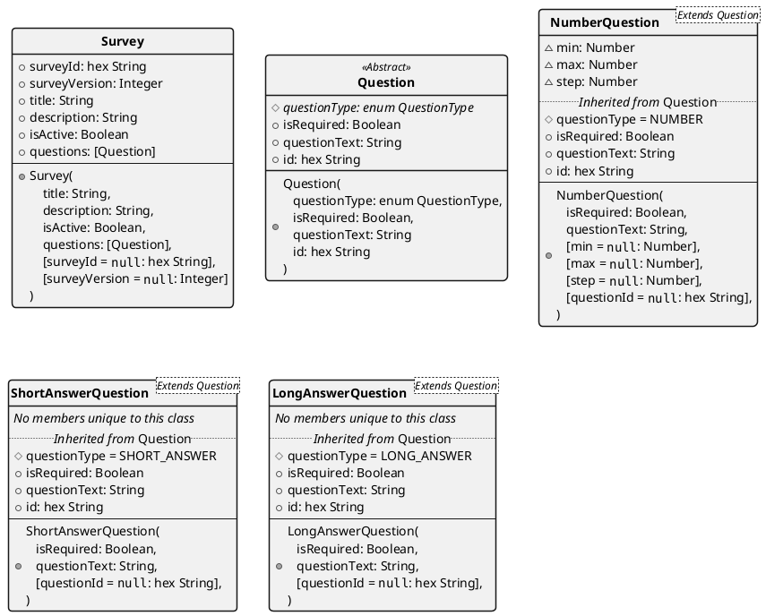

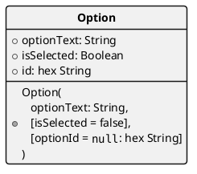

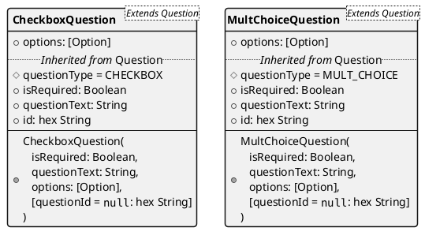

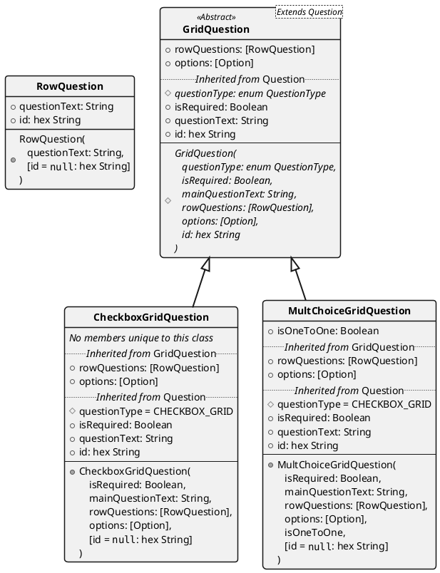

### Creating a new Survey

We will try to implement survey creation in a similar way to Google Forms. More specifically, we will try to save progress to the server in frequent intervals as an admin creates the survey.

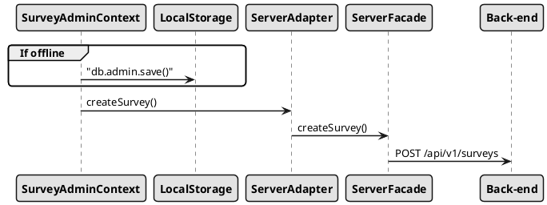

### Current SurveyAdminContext structure

Features

- Edit stack to support undo/redo

Question types

- Short answer
- Multiple choice

Product types

- AdminItem
  - Preview
  - Editor
- Question
- State
- Reducer

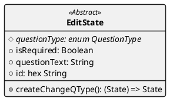

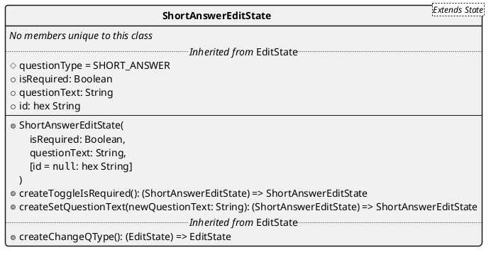

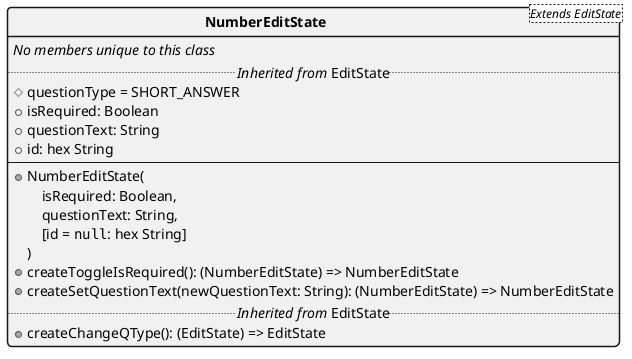

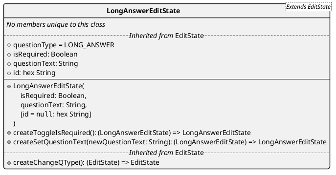

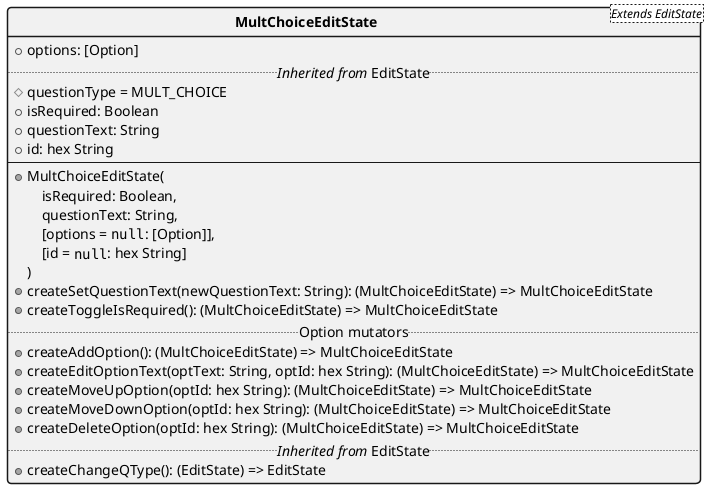

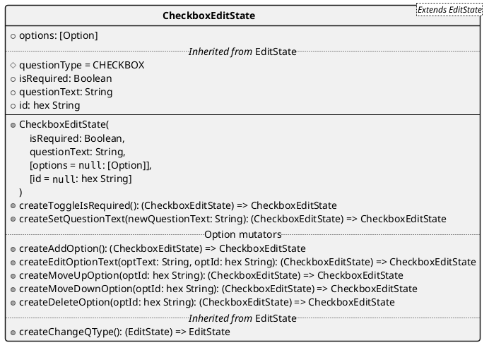

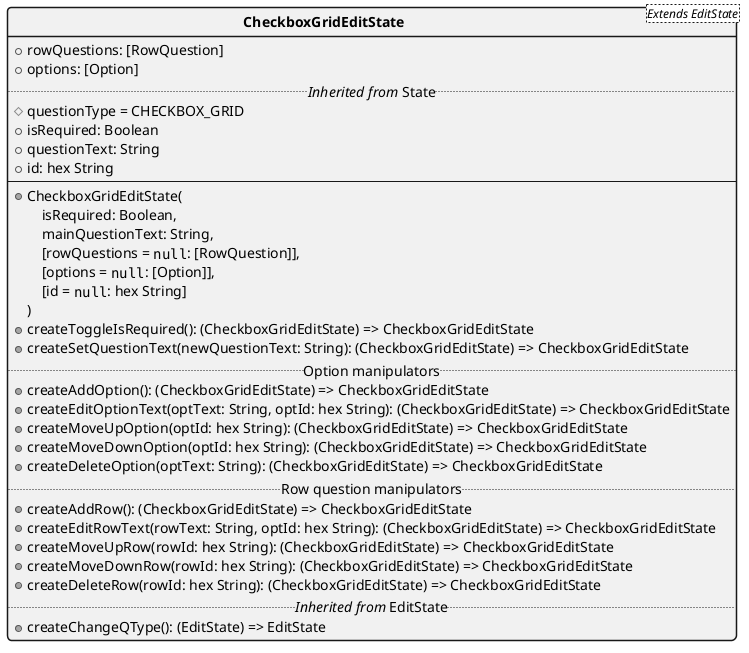

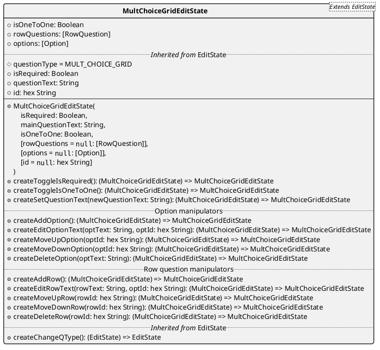

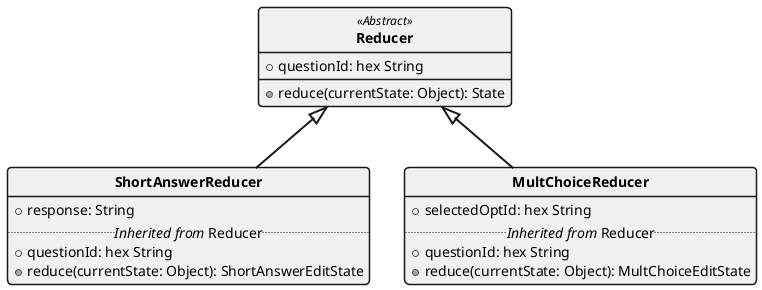
